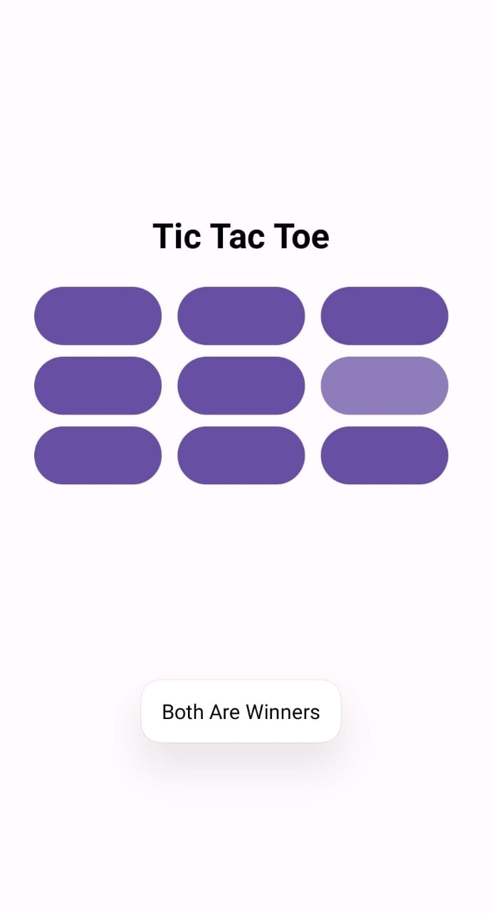

# TicTacToe for Android

## Overview

This is a simple Tic Tac Toe game developed for Android devices using Kotlin. The game features two-player gameplay, intuitive touch controls, clear win/loss/draw indications, and auto reset.

## Features

- Two-player gameplay
- Intuitive touch controls
- Clear win/loss/draw indications
- Auto reset 
## Getting Started

- Clone or download this repository.
- Open the project in Android Studio.
- Build and run the app on an Android device or emulator.
## How to Play

- Players take turns tapping on empty cells to place their marks (X or O).
- The first player to get three of their marks in a row (horizontal, vertical, or diagonal) wins.
- If all cells are filled without a winner, the game ends in a draw.

## Contributing

- Pull requests are welcome! 

## Enjoy!

